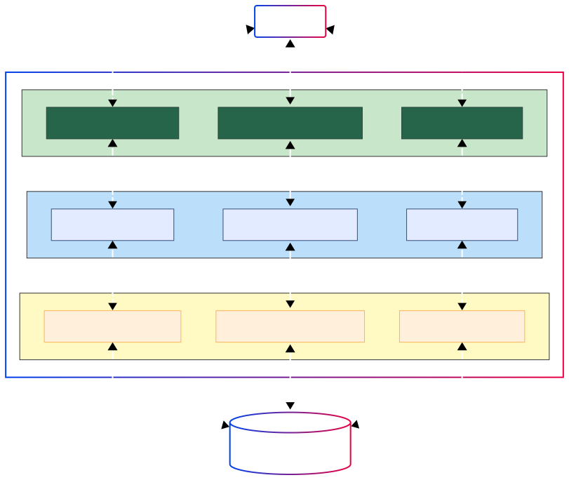
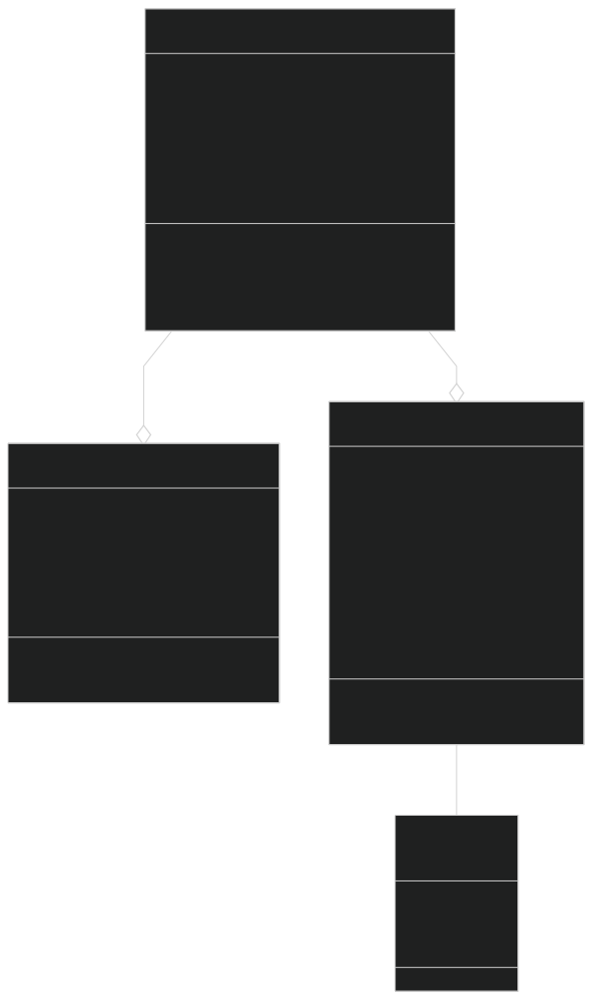

# Enviro365 Waste Management API
## Homepage UI


## Dashboard UI


## Project Overview
A Spring Boot REST API for the Enviro365 waste sorting mobile application, designed to promote sustainable waste management practices and environmental consciousness.

## Table of Contents
- [Technologies Used](#technologies-used)
- [Project Structure](#project-structure)
- [System Architecture](#system-architecture)
- [Database Schema](#database-schema)
- [API Documentation](#api-documentation)
- [UI Examples](#ui-examples)
- [Testing](#testing)
- [Setup and Installation](#setup-and-installation)


## Dependencies
- Java 17
- Spring Boot 3.4.2
- Spring Data JPA
- H2 Database
- Maven
- Spring Validation
- Lombok

## Project Structure
```md
src/
├── main/
│   ├── java/
│   │   └── com/enviro/assessment/grad001/thabanglenonyana/
│   │       ├── Application.java
│   │       ├── category/
│   │       │   └── (**Waste Category Layers**)
│   │       ├── guideline/
│   │       │   └── (**Disposal Guidline Layers**)
│   │       ├── tip/
│   │       │   └── (**Recycling Tip Layers**)
│   │       └── exception/
│   │           └── (Custom exceptions)
│   └── resources/
│        ├── static/ 
│        |   ├── components
│        |   ├── js
│        |   ├── pages
│        |   └── css
│        ├── application.properties
│        ├── 1-schema.sql 
|        └── 2-data.sql 
└── test/
│    └── java/
│        └── com/enviro/assessment/grad001/thabanglenonyana/
│            └── waste_management/
│               ├── WasteCategoryTest.java          
│               ├── DisposalGuidelineTest.java      
│               └── RecyclingTipTest.java           
```

## System Architecture
The system follows a layered architecture pattern with clear separation of concerns:



### Layers
| Layer                   | Component                  | Description                                                                                   |
|-------------------------|----------------------------|-----------------------------------------------------------------------------------------------|
| **API/Controller Layer**| WasteCategoryController    | Handles HTTP requests related to waste categories, providing endpoints for CRUD operations    |
|                         | DisposalGuidelineController| Manages endpoints for disposal guidelines, processing user requests for proper waste disposal instructions |
|                         | RecyclingTipController     | Controls endpoints for recycling tips, serving information about best recycling practices      |
| **Service Layer**       | WasteCategoryService       | Implements business logic for waste categorization, including validation and processing of waste category data |
|                         | DisposalGuidelineService   | Contains business rules and processing logic for disposal guidelines, ensuring proper waste disposal methods |
|                         | RecyclingTipService        | Manages business logic for recycling tips, including filtering and organizing recycling recommendations |
| **Repository Layer**    | WasteCategoryRepository    | Handles database operations for waste categories, providing data access and persistence        |
|                         | DisposalGuidelineRepository| Manages database interactions for disposal guidelines, storing and retrieving disposal instructions |
|                         | RecyclingTipRepository     | Handles database operations for recycling tips, maintaining the recycling information database  |
| **Additional Components**| API Clients               | External applications or users that interact with the system through the API endpoints         |
|                         | Waste Management DB        | Central database storing all waste management related data, including categories, guidelines, and recycling tips |


## Class Diagram



- **Core Domain Entities and Relationships**: The diagram clearly shows how WasteCategory, DisposalGuideline, and RecyclingTip entities interact within the system, forming the foundation of our waste management domain.

- **Attributes and Methods**: Each class is detailed with its essential properties (like id, name, description) and behaviors (methods), providing a complete view of the data structure and available operations.

- **Relationship Mapping**: Demonstrates how one WasteCategory can have multiple DisposalGuidelines and RecyclingTips, reflecting the real-world relationship between waste types and their management instructions.

- **Data Model Structure**: Provides developers with a clear blueprint of how data is organized and accessed within the application, facilitating better understanding of the system's data flow.


## API Documentation
RESTful API for the Enviro365 waste management application. The API provides endpoints for managing waste categories, disposal guidelines, and recycling tips. All endpoints are prefixed with `/api`.

Interactive API documentation is available at:
- Swagger UI: http://localhost:8080/swagger-ui.html
- OpenAPI JSON: http://localhost:8080/v3/api-docs

### Waste Categories
| Method | Endpoint | Description | Request Body | Response Body | Status Codes |
|--------|----------|-------------|--------------|---------------|--------------|
| GET | `/categories` | List all categories | N/A | [response](/docs/api/categories/list-response.json) | 200, 404 |
| POST | `/categories` | Create new category | [request](/docs/api/categories/create-request.json) | [response](/docs/api/categories/create-response.json) | 201, 400, 409 |
| GET | `categories/{id}` | Get category by ID | N/A | [response](/docs/api/categories/get-response.json) | 200, 404 |
| PUT | `categories/{id}` | Update category | [request](/docs/api/categories/update-request.json) | [response](/docs/api/categories/update-response.json) | 200, 400, 404 |
| DELETE | `/categories/{id}` | Delete category | N/A | N/A | 204, 404 |

### Disposal Guidelines
| Method | Endpoint | Description | Request Body | Response Body | Status Codes |
|--------|----------|-------------|--------------|---------------|--------------|
| GET | `/guidelines` | List all guidelines | N/A | [response](/docs/api/guidelines/list-response.json) | 200 |
| GET | `/guidelines/{id}` | Get guideline by ID | N/A | [response](/docs/api/guidelines/get-response.json) | 200, 404 |
| PUT | `/guidelines/{id}` | Update guideline | [request](/docs/api/guidelines/update-request.json) | [response](/docs/api/guidelines/update-response.json) | 200, 400, 404 |
| DELETE | `/guidelines/{id}` | Delete guideline | N/A | N/A | 204, 404 |
| PATCH | `/guidelines/{guidelineId}/assign/{categoryId}` | Assign guideline to category | N/A | [response](/docs/api/guidelines/assign-response.json) | 200, 400, 404 |
| PATCH | `/guidelines/{guidelineId}/unassign` | Remove category assignment | N/A | [response](/docs/api/guidelines/unassign-response.json) | 200, 404 |

### Recycling Tips
| Method | Endpoint | Description | Request Body | Response Body | Status Codes |
|--------|----------|-------------|--------------|---------------|--------------|
| GET | `/tips` | List all tips | N/A  | [response](/docs/api/tips/list-response.json) | 200, 404 |
| POST | `/tips` | Create new tip | [request](/docs/api/tips/create-request.json) | [response](/docs/api/tips/create-response.json) | 201, 400, 409 |
| GET | `/tips/{id}` | Get tip by ID | N/A  | [response](/docs/api/tips/get-response.json) | 200, 404 |
| PUT | `/tips/{id}` | Update tip | [request](/docs/api/tips/update-request.json) | [response](/docs/api/tips/update-response.json) | 200, 404, 400 |
| DELETE | `/tips/{id}` | Delete tip | N/A  | N/A  | 204, 404 |
| PATCH | `/tips/{tipId}/assign/{categoryId}` | Assign tip to category | N/A | [response](/docs/api/tips/assign-response.json) | 200, 400, 404 |
| PATCH | `/tips/{tipId}/unassign` | Remove category assignment | N/A | [response](/docs/api/tips/unassign-response.json) | 200, 404 |

## API Error Handling

The waste management API implements comprehensive error handling for all endpoints:

| Status Code | Description | Example Scenarios |
|-------------|-------------|-------------------|
| 200 OK | Request successful | Get resource, Update resource |
| 201 CREATED | Resource created | Create new resource |
| 204 NO_CONTENT | Resource deleted | Delete operations |
| 400 BAD_REQUEST | Invalid input/validation error | Empty title, Invalid format, Illegal assignment |
| 404 NOT_FOUND | Resource not found | Invalid ID |
| 409 CONFLICT | Resource conflict | Duplicate title |
| 500 SERVER_ERROR | Server error | Unexpected errors |

### Exception Handling Examples
- [`ResourceNotFoundException`](src/main/java/com/enviro/assessment/grad001/thabanglenonyana/waste_management/exception/ResourceNotFoundException.java): When requested resource is not found
- [`ConstraintViolationException`](jakarta.validation.ConstraintViolationException): For validation failures
- General runtime exceptions: Mapped to INTERNAL_SERVER_ERROR

### API Request Sequence Diagram


## UI Examples


## Testing

### Unit Tests Coverage
The application includes comprehensive unit tests covering:

#### WasteCategory Operations
- CRUD operations (Create, Read, Update, Delete)
- Input validation
- Error scenarios
- Service exceptions

#### Test Categories
1. **Success Scenarios**
   - Get all categories
   - Get category by ID
   - Create category
   - Update existing category
   - Delete category

2. **Validation Tests**
   - Empty category name
   - Null description
   - Invalid data format

3. **Error Handling**
   - Non-existing category
   - Database errors
   - Constraint violations

4. **Edge Cases**
   - Empty list handling
   - Service exceptions
   - Update conflicts

## Setup and Installation
### 1. Prerequisites
   - Java 17 or higher
   - Maven
   - Your favorite IDE (IntelliJ IDEA recommended)

### 2. Clone the repository.
```bash
    git clone [repository-url]
```

### 3. configure application properties.
```bash
spring.h2.console.enabled=true
spring.datasource.url=jdbc:h2:mem:wastesortdb
```

### 4. Build and run the application.
```bash
./mvnw build
./mvnw spring-boot:run

